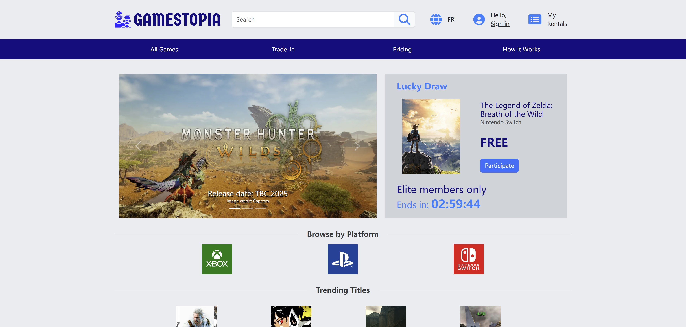
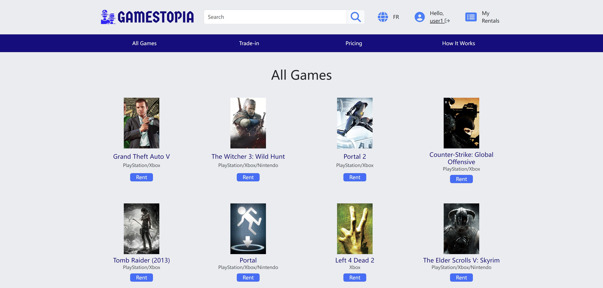
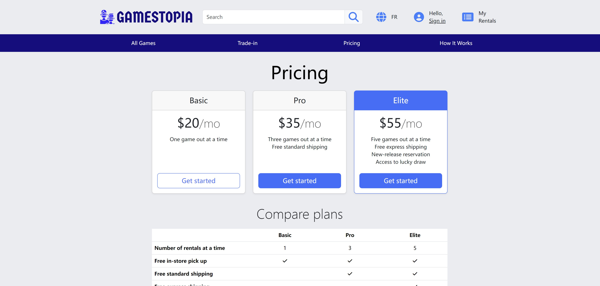
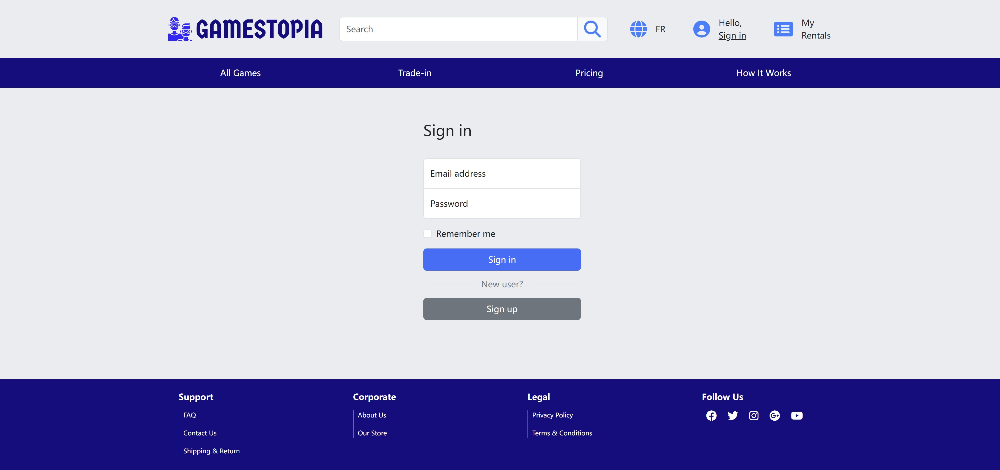
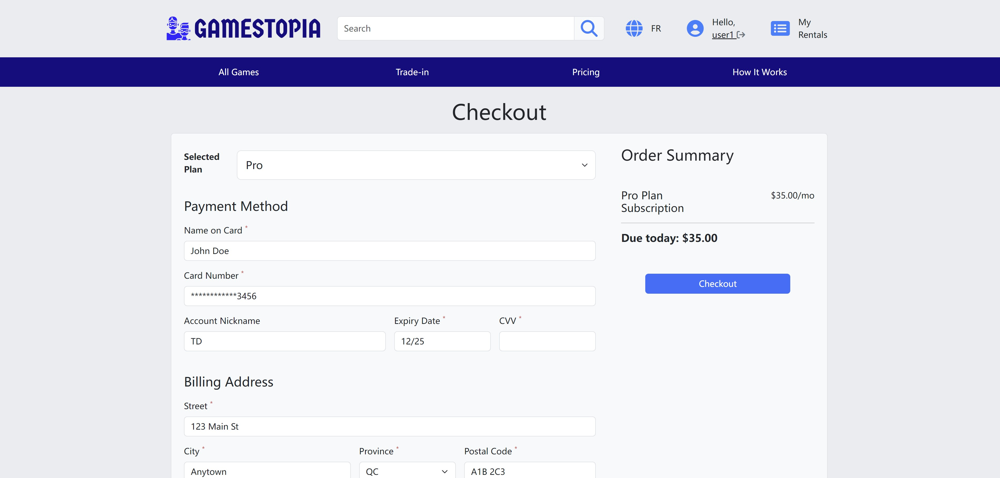
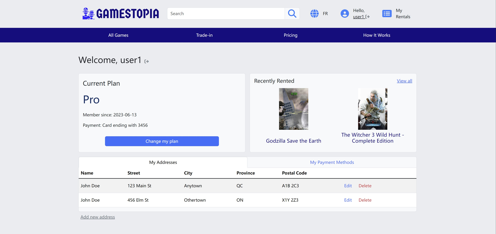

## Gamestopia - Game Rental Service

Gamestopia is an intuitive game rental service that offers users the ability to browse and rent games across multiple platforms with subscription-based pricing. Developed with JavaScript, Node.js, and MongoDB, the platform supports dynamic rental plans, making it easy for users to manage their gaming preferences.

## Screenshots

### Home

### Browse

### Pricing

### Sign in

### Checkout

### User Dashboard

